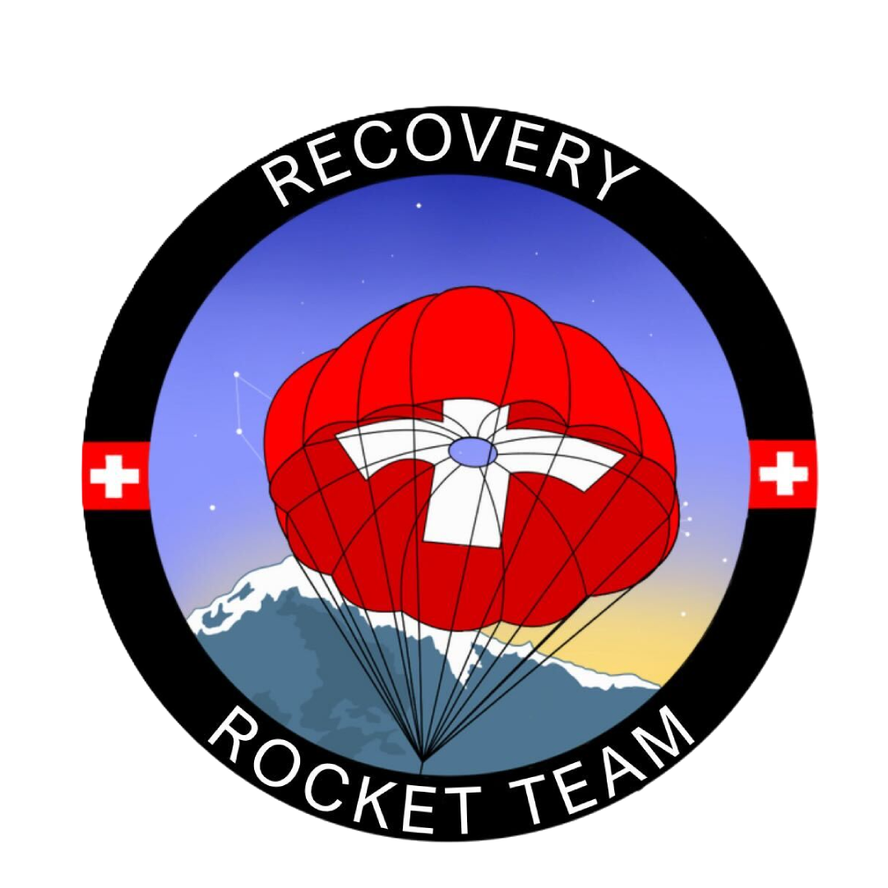

# ERT's Recovery Simulation Software

<p align="center">
  
</p>

<p align="center">
  <strong>SPLAT - Slow Parachute Landings Avoid Trauma</strong>
</p>

<p align="center">
  
  
  
</p>

## Overview

SPLATsim is a simulation application developed for analysing rocket parachute recovery systems. This tool provides modeling of parachute deployment scenarios with particular emphasis on dual-event recovery systems employing reefing techniques.


## **Simulation Types**
- **Single Event**: Traditional single parachute deployment
- **Dual Event**: Advanced two-stage deployment with reefing

### Reefing Simulation
The reefed drag coefficient is found empirically. Due to limited data, this is an approximation of the true reefed $C_d$ and it may vary quite a bit

## Installation

### Required Dependencies

```bash
pip install tkinter matplotlib pillow numpy
```

### Clone the Repository

```bash
git clone git@github.com:EPFLRocketTeam/SPLATsim.git
cd SPLATsim
```

## Quick Start

1. **Launch the application:**
   ```bash
   python main.py
   ```

2. **Configure parameters:**
   - Set rocket specifications (mass, diameter, drag coefficient)
   - Define parachute properties (diameter, Cd values, reefing ratio)
   - Adjust environmental conditions (air density, gravity)

3. **Run simulation:**
   - Press `F5` or click "Run Simulation"
   - View results in the embedded plot and results panel

4. **Analyze results:**
   - Examine landing velocity, flight time, and acceleration data
   - Generate plots for detailed analysis

## Application Structure

```
splat/
├── gui/
│   ├── __init__.py
│   ├── main_window.py      # Main application window
│   ├── input_panel.py      # Parameter input interface
│   ├── plot_panel.py       # Results visualization
│   └── widgets.py          # Custom UI components
├── models/
│   ├── __init__.py
│   ├── parachute.py        # Parachute physics models
│   └── rocket.py           # Rocket configuration
├── simulation/
│   ├── __init__.py
│   └── simulation.py       # Simulation engines
├── assets/
│   └── RE_TRANS.png        # Application logo
├── main.py                 # Application entry point
└── README.md
```

## Version History

- **v1.0.0** (June 2025) - Initial release
---

<p align="center">
  <em>Developed with ❤️ by the EPFL Rocket Team</em>
</p>